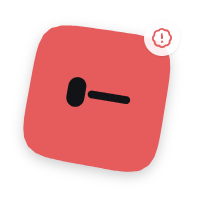
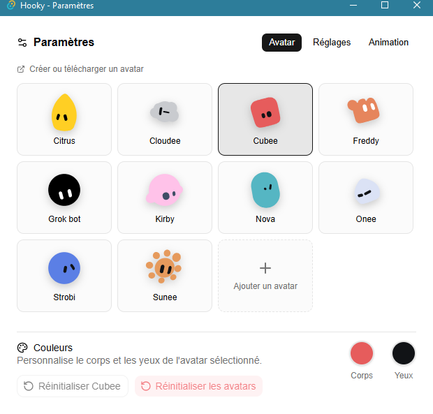
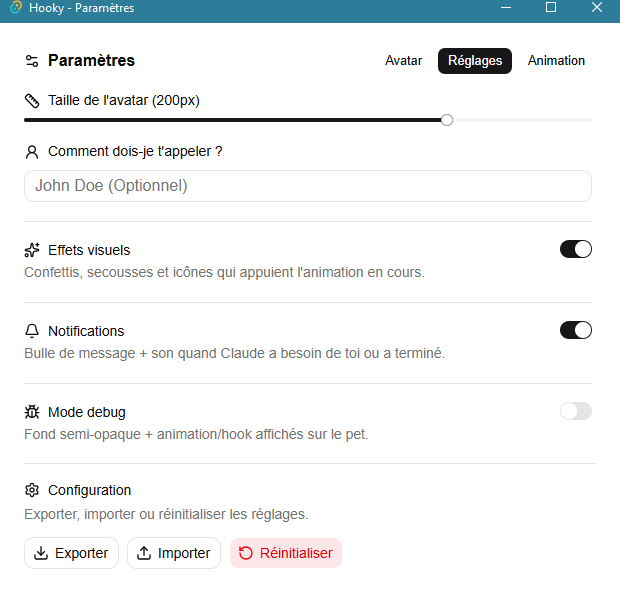
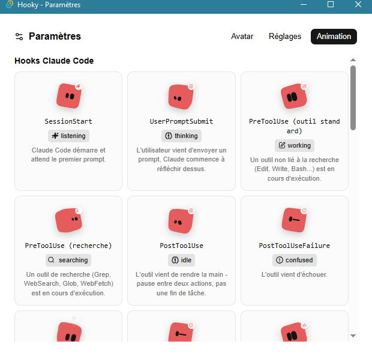

<h1 align="center">Hooky 🐾</h1>

<p align="center">
  <b>A tiny desktop pet that reacts in real time to Claude Code hooks.</b><br>
  <i>Hooky never sees your code — only the events, like nerve impulses.</i>
</p>

<p align="center">
  <a href="README.fr.md">🇫🇷 Lire en français</a>
</p>


---

## 📸 Screenshots

### Meet Cubee

<p align="center">
  
  
  
  
  
  
</p>
<p align="center"><sub>listening · thinking · searching · working · confused · celebrate</sub></p>

### Pick your skin

<p align="center">
  
  
  
  
</p>
<p align="center"><sub>10+ built-in skins, swappable anytime in Settings → Avatar</sub></p>

### Settings

<p align="center">
  
  
  
</p>

## 🚀 Key Features

- **Real-time reactions**: `SessionStart`, `PreToolUse`, `Notification`, `Stop`... every Claude Code hook drives a matching animation, live.
- **Zero code awareness**: Hooky only receives event payloads over a local HTTP server — it never touches your files or your prompts.
- **10+ swappable skins**: pick Cubee, Freddy, Kirby, Nova, Sunee and more from the Settings panel, each with its own color overrides.
- **Codex pets**: any pet installed in `~/.codex/pets` (e.g. with `npx petdex install <name>`) shows up in Settings → Avatar and reacts to hooks like the built-in skins. Browse more on [Petdex](https://petdex.dev/).
- **Notification bubbles**: a speech bubble pops up next to the avatar when Claude needs you or just finished.
- **One-click hook install**: merges the required config into `~/.claude/settings.json` without touching your existing hooks.
- **Update badge**: a small badge appears on the avatar when a new release is out — no silent auto-update.

## 💻 Technical Stack

| Category      | Technologies                                                                                                                                                                         |
| :------------ | :----------------------------------------------------------------------------------------------------------------------------------------------------------------------------------- |
| **Frontend**  |    `shadcn/ui` |
| **Backend**   |  `axum` + `tokio` — local HTTP server (`127.0.0.1:4242`) that receives hooks and relays them to the frontend                 |
| **Animation** | [`@bible-strong/avatar-react`](https://github.com/smontlouis/bible-strong-avatar-lab) — procedural SVG engine, no external animation library                                         |

## 🐾 Codex pets

Hooky reads the pets installed for [Codex](https://petdex.dev/) straight from `~/.codex/pets` (`C:\Users\<you>\.codex\pets` on Windows) — nothing is copied or bundled. Install one, open **Settings → Avatar**, hit the refresh button next to **Pets Codex**, and pick it.

```bash
npx petdex install <name>
```

A Codex pet plays the spritesheet row that matches what Claude Code is doing (see the "Ligne Codex" column in [`docs/EVENTS.md`](docs/EVENTS.md)), runs left or right while you drag it, and dozes off when no session is active. Each pet belongs to its own author and comes with its own license: Hooky doesn't redistribute any of them, it only displays the ones already on your machine.

## 📦 Installation

1. Download the latest installer (`Hooky_x.y.z_x64-setup.exe`) from the [Releases page](https://github.com/baptistelechat/hooky/releases/latest).
2. Run the installer.

   > ⚠️ **Windows will show "Windows protected your PC"** (SmartScreen). This is expected: the installer isn't signed with a paid certificate. The code is open-source and available in this repo. Click **"More info"** then **"Run anyway"** to continue.

3. Once installed, Hooky launches and sits in the system tray.
4. Open **Settings** (right-click the tray icon, or double-click the avatar) and click **"Install Claude Code hooks"** — this merges the required config into `~/.claude/settings.json` without touching your existing hooks.

Hooky stays asleep until a Claude Code session is active, and relaunches automatically on the next `SessionStart` if you closed it.

## ⬆️ Updates

A badge appears on the avatar when a new version is available (checked on launch, plus a "Check for updates" button in Settings). Updating means re-downloading the installer from the Releases page — no silent auto-update.

## 🧠 States

Full list of the Claude Code events Hooky listens to and their matching animation: [`docs/EVENTS.md`](docs/EVENTS.md).

## 🛠️ Development

Make sure you have **Node.js** and **PNPM** installed.

1. **Clone the project**

   ```bash
   git clone https://github.com/baptistelechat/hooky.git
   cd hooky
   ```

2. **Install dependencies**

   ```bash
   pnpm install
   ```

3. **Run the app in dev mode**

   ```bash
   pnpm tauri:dev    # front + backend hot reload
   ```

4. **Build the installer**

   ```bash
   pnpm tauri:build
   ```

Other useful scripts: `pnpm lint`, `pnpm typecheck`.

Architecture, technical decisions and progress log: [`docs/BRIEF.md`](docs/BRIEF.md) and [`docs/ROADMAP.md`](docs/ROADMAP.md).

---

## 😸 Maintainers

Made with ❤️ by [Baptiste LECHAT](https://github.com/baptistelechat)

## 📝 License

This project is [AGPL-3.0](LICENSE) licensed. The animation engine is copied from [`smontlouis/bible-strong-avatar-lab`](https://github.com/smontlouis/bible-strong-avatar-lab) (AGPL-3.0) — the whole repo is under the same license, full source included.
